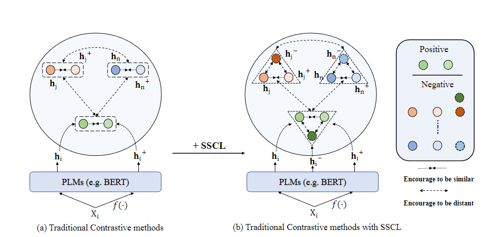

# Alleviating Over-smoothing for Unsupervised Sentence Representation
This is the project of our ACL 2023 paper: [Alleviating Over-smoothing for Unsupervised Sentence Representation](https://arxiv.org/pdf/2305.06154).

Our work mainly based on [SimCSE project](https://github.com/princeton-nlp/SimCSE), thanks to SimCSE!

## Quick Links

  - [Overview](#overview)
  - [Getting Started](##setup)
  - [Train SSCL](#training)
    - [Requirements](#requirements)
    - [Evaluation](#evaluation)
    - [Training](#training)
  - [Citation](#citation)

## Overview

we present a new training paradigm based on contrastive learning:  Simple contrastive method named Self-Contrastive Learning (SSCL), which can significantly improve the performance of learned sentence representations while alleviating the over-smoothing issue. Simply Said, we utilize hidden representations from intermediate PLMs layers as negative samples  which the final sentence representations should be away from. Generally, our SSCL has several advantages: (1) It is fairly straightforward and does not require complex data augmentation techniques; (2) It can be seen as a contrastive framework that focuses on mining negatives effectively, and can be easily extended into different sentence encoders that aim for building positive pairs; (3) It can further be viewed as a plug-and-play framework for enhancing sentence representations.


## Setup
First, install PyTorch by following the instructions from the [official website](https://pytorch.org/get-started/previous-versions/). To faithfully reproduce our results, please use the correct 1.9.1 version corresponding to your platforms/CUDA versions. Install PyTorch by the following command,

```
pip install torch==1.9.1+cu111 torchvision==0.10.1+cu111 torchaudio==0.9.1 -f https://download.pytorch.org/whl/torch_stable.html
``` 
Then run the following script to install the remaining dependencies,

```bash
pip install -r requirements.txt
```

### Evaluation
Our evaluation code for sentence embeddings is based on a modified version of [SentEval](https://github.com/facebookresearch/SentEval). It evaluates sentence embeddings on semantic textual similarity (STS) tasks and downstream transfer tasks. For STS tasks, our evaluation takes the "all" setting, and report Spearman's correlation. 

Before evaluation, please download the evaluation datasets by running
```bash
cd SentEval/data/downstream/
bash download_dataset.sh
```

Then come back to the root directory, you can evaluate any `transformers`-based pre-trained models using our evaluation code. For example,
```bash
python evaluation.py \
    --model_name_or_path sscl-bert-base-uncased \
    --pooler cls \
    --task_set sts \
    --mode test
```

Arguments for the evaluation script are as follows,

* `--model_name_or_path`: The name or path of a `transformers`-based pre-trained checkpoint. You can directly use the models in the above table.
* `--pooler`: Pooling method. Now we support
    * `cls` (default): Use the representation of `[CLS]` token. A linear+activation layer is applied after the representation (it's in the standard BERT implementation). 
    * `cls_before_pooler`: Use the representation of `[CLS]` token without the extra linear+activation.
    * `avg`: Average embeddings of the last layer. If you use checkpoints of SBERT/SRoBERTa ([paper](https://arxiv.org/abs/1908.10084)), you should use this option.
    * `avg_top2`: Average embeddings of the last two layers.
    * `avg_first_last`: Average embeddings of the first and last layers. If you use vanilla BERT or RoBERTa, this works the best.
* `--mode`: Evaluation mode
    * `test` (default): The default test mode. To faithfully reproduce our results, you should use this option.
    * `dev`: Report the development set results. Note that in STS tasks, only `STS-B` and `SICK-R` have development sets, so we only report their numbers. It also takes a fast mode for transfer tasks, so the running time is much shorter than the `test` mode (though numbers are slightly lower).
    * `fasttest`: It is the same as `test`, but with a fast mode so the running time is much shorter, but the reported numbers may be lower (only for transfer tasks).
* `--task_set`: What set of tasks to evaluate on (if set, it will override `--tasks`)
    * `sts` (default): Evaluate on STS tasks, including `STS 12~16`, `STS-B` and `SICK-R`. This is the most commonly-used set of tasks to evaluate the quality of sentence embeddings.
    * `transfer`: Evaluate on transfer tasks.
    * `full`: Evaluate on both STS and transfer tasks.
    * `na`: Manually set tasks by `--tasks`.
* `--tasks`: Specify which dataset(s) to evaluate on. Will be overridden if `--task_set` is not `na`. See the code for a full list of tasks.

### Training

**Data**

 You can run `data/download_wiki.sh` and `data/download_nli.sh` to download the two datasets.

**Training scripts**
 In `run_unsup_example.sh`, we provide a single-GPU (or CPU) example for the unsupervised version. We explain the arguments in following:
* `--train_file`: Training file path. We support "txt" files (one line for one sentence) and "csv" files (2-column: pair data with no hard negative; 3-column: pair data with one corresponding hard negative instance). You can use our provided Wikipedia or NLI data, or you can use your own data with the same format.
* `--model_name_or_path`: Pre-trained checkpoints to start with. For now we support BERT-based models (`bert-base-uncased`, `bert-large-uncased`, etc.).
* `--temp`: Temperature for the contrastive loss.
* `--pooler_type`: Pooling method. It's the same as the `--pooler_type` in the [evaluation part](#evaluation).
* `--mlp_only_train`:  You should use this argument when training SSCL models.
* `--hard_negative_weight`: If using hard negatives (i.e., there are 3 columns in the training file), this is the logarithm of the weight. For example, if the weight is 1, then this argument should be set as 0 (default value).
* `--do_mlm`: Whether to use the MLM auxiliary objective. If True:
  * `--mlm_weight`: Weight for the MLM objective.
  * `--mlm_probability`: Masking rate for the MLM objective.
* `--do_neg`: Whether to use negatives in SSCL.
* `--hard_negative_layers`: How many previous layers to construct negative layers.

All the other arguments are standard Huggingface's `transformers` training arguments. Some of the often-used arguments are: `--output_dir`, `--learning_rate`, `--per_device_train_batch_size`. In our example scripts, we also set to evaluate the model on the STS-B development set (need to download the dataset following the [evaluation](#evaluation) section) and save the best checkpoint.

For results in the paper, we use Nvidia A100 GPUs with CUDA 11. Using different types of devices or different versions of CUDA/other softwares may lead to slightly different performance.


**Convert models**

Our saved checkpoints are slightly different from Huggingface's pre-trained checkpoints. Run `python sscl_to_huggingface.py --path {PATH_TO_CHECKPOINT_FOLDER}` to convert it. After that, you can evaluate it by our [evaluation](#evaluation) code or directly use it [out of the box](#use-our-models-out-of-the-box).

## Citation

Please cite our paper if you use SSCL in your work:

<!-- ```bibtex
@inproceedings{gao2021simcse,
   title={{SimCSE}: Simple Contrastive Learning of Sentence Embeddings},
   author={Gao, Tianyu and Yao, Xingcheng and Chen, Danqi},
   booktitle={Empirical Methods in Natural Language Processing (EMNLP)},
   year={2021}
}
``` -->
